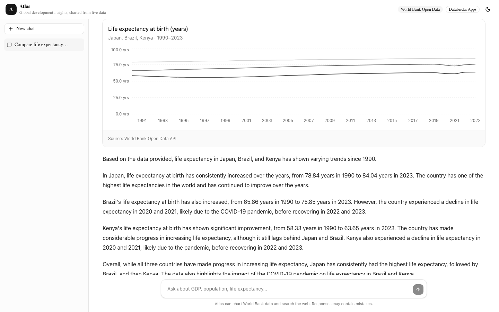

# Atlas — Global Development Insights

An AI chatbot that answers questions about world development with **live World Bank data**, rendered as charts inside the conversation. Ask *"Compare GDP per capita of India and Brazil since 2000"* and the model calls a typed frontend tool, fetches real indicator data, draws the chart, and summarizes the trend from the series it actually received. Charted figures always come from the API rather than the model's memory — with one known exception when a tool returns no data, documented under [Known limitations](#known-limitations).

Deployed as a **Databricks App**, powered by **Databricks Foundation Model APIs** (Llama 3.3 70B), with a fully deterministic **Playwright** E2E suite.

**Features**: streaming chat with typing indicator and stop-generation · multi-conversation history (new/switch/delete, survives reloads) · in-chat charts from live World Bank data · web search with cited sources rendered in-chat · dark mode · responsive (desktop sidebar / mobile sheet) · deterministic E2E suite covering all of it



*Real output: the model called the chart tool, the app fetched live World Bank data, and every figure in the summary comes from the series it received.*

## Stack

| Layer | Choice | Notes |
|---|---|---|
| Framework | Next.js 16 (App Router, TypeScript) | Standalone output for deployment |
| UI | shadcn/ui + Tailwind v4 | Cards, charts (Recharts), skeleton states |
| Agentic chat | CopilotKit | Runtime + `useCopilotAction` generative UI |
| LLM | Databricks Foundation Model APIs | OpenAI-compatible chat completions |
| Data | World Bank Open Data API | Public, no key, 9 curated indicators |
| E2E tests | Playwright | Hermetic: in-app mock LLM + fixture interception |
| Hosting | Databricks Apps | Asset Bundle deploy, OAuth M2M auth |

## Architecture

```
Browser ──► Next.js (Databricks App)
   │            ├─ /api/copilotkit ──► CopilotKit runtime (singleton, warmed)
   │            │                        └─► Databricks serving endpoint
   │            │                            (chat completions + tool calls)
   │            │                            auth: PAT (local) / OAuth M2M (deployed)
   │            ├─ /api/worldbank/series ──► World Bank Open Data API
   │            │                            (zod-validated, cached 24h)
   │            ├─ /api/search ──► Wikipedia (keyless) or Tavily (via env)
   │            ├─ /api/mock-llm ─ deterministic scripted model (test mode only)
   │            └─ /api/health ─ liveness probe + runtime warm-up
   │
   ├─ useCopilotAction("renderIndicatorChart")
   │    model requests tool → handler fetches data → chart renders in chat
   │    → data returns to model → model writes a grounded summary
   ├─ useCopilotAction("searchWeb")
   │    same loop → numbered sources card renders in chat → model cites them
   └─ ConversationsProvider ──► localStorage
        sidebar history: save on run-settle, lossless AG-UI JSON round-trip
```

The model is given two tools: `renderIndicatorChart(countries, indicatorId, startYear, endYear)` and `searchWeb(query)`. The indicator catalog is a fixed allowlist ([src/lib/indicators.ts](src/lib/indicators.ts)) injected into the system prompt, so the model can't invent indicator codes and every tool call is validatable server-side. Search results always carry real URLs, rendered as citations the user can check.

## Design decisions worth reviewing

These came out of real debugging during the build, and each is documented where it lives in the code:

1. **The adapter pins the Chat Completions API** ([src/lib/chat-adapter.ts](src/lib/chat-adapter.ts)). CopilotKit's default OpenAI adapter resolves models through the AI SDK, which defaults to OpenAI's newer *Responses* API — an endpoint Databricks serving endpoints don't implement. The subclass forces `.chat()`, which both Databricks and the test mock speak.

2. **The CopilotKit runtime is a warmed singleton** ([src/lib/copilot-runtime.ts](src/lib/copilot-runtime.ts)). Two failure modes found via E2E: per-request runtime instances lose `agent/connect` state between HTTP requests (messages get silently dropped), and on a cold server the page's simultaneous connect calls can race first-time initialization — the client then marks the agent unavailable and never retries. `/api/health` warms the runtime, so platform health probes fix the cold-start case before a user ever hits it.

3. **The chat UI gates on agent readiness** ([src/app/page.tsx](src/app/page.tsx)). CopilotKit's context ships a no-op `sendMessage` until discovery completes; the UI exposes `isAvailable` as a `data-copilot-ready` attribute, shows a "Connecting…" state, and gives the E2E suite a deterministic wait target.

4. **E2E tests are hermetic** ([playwright.config.ts](playwright.config.ts)). With `LLM_PROVIDER=mock`, the app serves a scripted OpenAI-compatible model from within itself ([src/app/api/mock-llm/…](src/app/api/mock-llm/v1/chat/completions/route.ts)) that exercises the full tool-call loop — including streaming deltas and split tool-call arguments. World Bank responses are stubbed per-test with Playwright fixtures. No network, no model bill, no flakes; the same suite runs against the deployed app via `E2E_BASE_URL`.

5. **World Bank calls go through our own route** ([src/app/api/worldbank/series/route.ts](src/app/api/worldbank/series/route.ts)). One zod-validated surface: ISO-code and year-range validation, indicator allowlisting, 24-hour response caching, partial-failure reporting (chart renders what it can, names what's missing), and a clean interception point for tests.

6. **Auth rotates without restarts** ([src/lib/databricks-auth.ts](src/lib/databricks-auth.ts)). Locally a PAT from `.env.local`; inside Databricks Apps, the injected service principal's OAuth client-credentials flow. The token is attached per-request via a fetch wrapper, so the long-lived runtime never holds a stale credential.

7. **Deploys ship the prebuilt standalone bundle** ([scripts/deploy.sh](scripts/deploy.sh)). Databricks Apps allows `npm install` at startup, but a large dependency tree inside the 10-minute startup window is fragile. Building locally means the deployed artifact is byte-identical to what the E2E suite validated, and cold start is just `node server.js`. The script also enforces the platform's 10 MB per-file limit.

8. **Chat history bridges to CopilotKit's real message store** ([src/components/chat/conversations-provider.tsx](src/components/chat/conversations-provider.tsx)). In CopilotKit 1.66, message state lives on the shared "default" agent in the v2 core registry — the documented-for-1.10 `CopilotMessagesContext` still exists but is an empty stub, discovered the hard way with an instrumented save-effect that always saw zero messages. `useAgent()` (from `@copilotkit/react-core/v2`) hands back that live agent, whose plain AG-UI JSON messages round-trip losslessly through localStorage — charts and source cards re-render on restore from their stored tool-call pairs. Restore is *self-healing*: the runtime's `agent/connect` handshake can reset message state after an early restore, so the provider re-applies (capped) whenever the transcript is empty but the active conversation isn't.

9. **Conversations persist client-side, by design**. No accounts, no database — a deliberate scope decision documented in [src/lib/conversations.ts](src/lib/conversations.ts). The store is a small module with a stable interface; swapping it for a Lakebase/Postgres implementation changes nothing above it. A mid-stream page refresh loses at most the in-flight exchange (saves land when a run settles).

10. **The custom chat UI stays on CopilotKit's free tier** ([src/components/chat/](src/components/chat/)). Bubbles, typing indicator, stop button, and input are custom components passed through `CopilotChat`'s documented override props (`UserMessage`, `AssistantMessage`, `Input`), with generative UI mounted via `message.generativeUI()`. No premium/headless license required — the pro-looking parts are composition, not a paid SDK tier.

## Running locally

```bash
npm install
cp .env.example .env.local   # fill in your workspace URL + PAT
npm run dev
```

`.env.local` needs a Databricks workspace (the [Free Edition](https://www.databricks.com/learn/free-edition) works) and a personal access token — see [.env.example](.env.example) for the exact fields. The World Bank and Wikipedia APIs need no credentials; set `TAVILY_API_KEY` to upgrade web search coverage.

No Databricks workspace handy? `npm run dev:mock` runs the whole app against the built-in deterministic model — every feature works except real LLM reasoning.

## Testing

```bash
npm run test:e2e          # full hermetic suite (builds + serves with mock LLM)
npm run test:e2e:ui       # same, in Playwright's UI mode
npm run test:e2e:live     # adds a live World Bank integration check
E2E_BASE_URL=https://<app-url> npx playwright test   # against a deployed app
```

17 tests cover: app shell and a11y basics, streaming text replies, the full tool-call → chart → summary loop, multi-country charts with partial failures, web search with cited sources and its failure card, conversation history (reload persistence, sidebar switching, confirmed deletion), streaming state indicators (stop ↔ send button swap), data-API error states, and input validation contracts for the World Bank route.

## Deploying

```bash
./scripts/deploy.sh
```

Builds, assembles the standalone bundle into `.appbuild/`, verifies file-size limits, deploys via a [Databricks Asset Bundle](databricks.yml), and starts the app. The bundle declares the serving endpoint as an app resource, so the platform auto-grants the app's service principal `CAN_QUERY` — no manual permission steps.

### Platform behaviors worth knowing

Four constraints shaped the deploy script. All were found by hitting them, and each is commented at the relevant line.

**The workspace-files API can't absorb concurrent uploads.** `databricks sync` uploads in parallel and, on Free Edition, fails with `unexpected EOF` and 60-second inactivity timeouts — it never converged across 25 retry passes. Measured sequentially, the same API served 784 files at ~250 ms each with a 100% success rate, and the CLI exposes no concurrency flag. Hence [scripts/upload_artifact.py](scripts/upload_artifact.py), which uploads one file at a time. Three smaller quirks live in that script too: `import-file` does not create parent directories (so a `mkdirs` pass runs first), it rejects double-slash paths, and `.databricks` is a reserved name the API refuses.

**Don't ship `node_modules`.** ~2,000 extra files reliably exhausted the upload path. The artifact ships the built app only, with a runtime-dependencies-only `package.json`; the platform runs `npm install` at startup. Next.js standalone output also leaves dangling symlinks into `node_modules`, which the uploader skips.

**Scoped tokens can't read bundle state.** A PAT without the `all-apis` scope gets 403 on the bundle state file, so app-code deploys go through `databricks sync` + `databricks apps deploy --source-code-path` rather than pure bundle deploys. The bundle still owns resource creation and grants.

**Free Edition app compute is not persistent.** Idle apps are stopped with *"App compute was stopped due to workspace or account status."* Restarting compute is not enough on its own: the active deployment reference is cleared too, so the app reports *"App has not been deployed yet"* until a fresh deploy runs. The uploaded source survives in the workspace, so recovery is a redeploy rather than a re-upload:

```bash
databricks apps start atlas-insights
```

`apps start` creates its own deployment from the last source path, so watch that deployment rather than issuing a second `apps deploy` (which is rejected while one is pending).

## Deliberately out of scope

- **RAG / Vector Search**: real infrastructure cost for marginal value in a two-tool assistant; the indicator catalog already grounds data answers, and web search grounds the rest. The natural next step is documented above.
- **File/photo upload**: Llama 3.3 is text-only; upload plumbing without a vision model is UI without capability. Swapping the serving endpoint to a multimodal model (Llama 4 Maverick) would make this a real feature rather than a checkbox.

## With more time

- **Server-side conversation store**: swap [src/lib/conversations.ts](src/lib/conversations.ts) for Lakebase/Postgres keyed by the app's authenticated user — the interface is already shaped for it.
- **RAG over Unity Catalog**: load World Bank metadata into a Vector Search index so the bot can answer "which indicator measures…" questions from documentation rather than the prompt catalog.
- **Model routing**: the endpoint name is already env-driven; a quality/latency toggle between Llama 3.3 70B and Llama 4 Maverick would be a few lines.
- **CI**: the suite is already hermetic and CI-shaped (`forbidOnly`, retries, HTML report); wiring GitHub Actions is config-only.
- **Accessibility pass**: axe-core assertions in the E2E suite beyond the current lang/role/label checks.

## Known limitations

Reviewed against the [OWASP Top 10 for LLM Applications (2025)](https://genai.owasp.org/llm-top-10/). The findings below are open, with the reasoning for leaving them open rather than patching them late.

**Model falls back on recall when a tool returns nothing (LLM09, Misinformation).** Asking for a future year — "highest GDP countries in 2026" — returns zero rows, because World Bank annual data currently ends at 2025. The chart correctly shows "no data available", but the model then recites GDP figures from memory instead of retrying with a valid range. The system prompt forbids inventing values; the model does it anyway on the empty-result path. The fix is a prompt that states the data boundary plus a tool error that instructs a retry, not a code change.

**Search results are not segregated from instructions (LLM01, Indirect Prompt Injection).** Results are passed back to the model as tool output with no delimiting or untrusted-content labeling. The default provider is Wikipedia, which anyone can edit, so injected text in an article body reaches the model's context. OWASP's mitigation — segregating external content so untrusted data cannot influence instructions — is not implemented.

**Result URLs are rendered without scheme validation (LLM05, Improper Output Handling).** `SourcesCard` puts the provider-supplied URL straight into an `href`. Wikipedia only ever returns `https:` URLs, so this is latent today, but the optional Tavily provider returns arbitrary web URLs and a `javascript:` scheme would not be rejected.

**No rate limiting on the API routes (LLM10, Unbounded Consumption).** `/api/copilotkit`, `/api/search`, and `/api/worldbank/series` each proxy to a paid or third-party endpoint with no throttle. The compensating control is that Databricks Apps gates every route behind workspace SSO, so there is no anonymous access — adequate for a demo, not for a public deployment.

**Streaming drops follow-up tool calls made after prose (platform limitation).** When Llama 3.3 writes a sentence and then issues another tool call in the same message, the Databricks serving endpoint's streaming parser fails to extract it and emits the raw `<function=…>` syntax as chat text, so the second call never runs. Reproduced against the live endpoint: identical request and messages, non-streaming returns proper structured `tool_calls`, streaming leaks the syntax. Recovering these would mean parsing the leaked syntax out of the stream and re-dispatching it.

**Charts are time series only.** The chart component renders lines; "give me a bar chart" or "rank the top N countries" has no matching tool, and the model is not told which chart types exist, so it improvises instead of declining.

**Dependencies carry known advisories (LLM03, Supply Chain).** `npm audit` reports 13 vulnerabilities in production dependencies (1 high: `undici` unbounded decompression), all transitive through CopilotKit's AI SDK packages. No automated scanning runs on push.

**Testing is integration-level only.** All 17 Playwright specs run end-to-end against a scripted mock LLM. That makes them fast, free, and deterministic, and it thoroughly covers this application's code — but it exercises no real model behavior, which is why the two model-behavior defects above reached the deployed app with a green suite. There are no unit tests for the data layer's parsing and partial-failure paths, and no CI runs the suite.

- Tool-call results return full time series to the model for summarization; for long ranges × many countries this spends tokens. A summary-stats-only variant would be cheaper but the chart needs the full series anyway.
- The World Bank API occasionally lags a year behind for some indicators; the chart footer names countries with no data rather than hiding them.
- Conversation history is per-browser (localStorage) and a mid-stream refresh drops the in-flight exchange — both stated trade-offs of the no-backend design.
- Wikipedia as the default search provider favors encyclopedic queries; current-events coverage needs the Tavily key.
